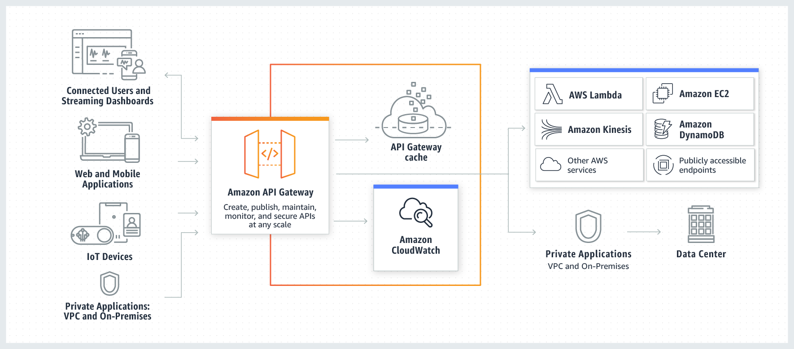

## REST API

[docs](http://localhost:5000/api-docs/) • [demo]()  

Boilerplate for creating a scalable and maintainable REST API's
 

## The Application specfications

- What are the sections the application will have

## User & Authentication

- Authentication will be done using JWT/cookies
- Database Setup with Mongodb Atlas
- User Model/schema/methods
- User Registration

  - Register a "user"
  - validate the inputs provided by the user
  - Once registered, a token will be sent along with a cookie(token)
  - Passwords must be harshed

- User Activation

  - An email will be sent to confirm a user registration before saving in the database
  - Once Activated, then user can login

- User Register with Gmail
  - Get Google client ID and Client Secret
  - Collect the user Info from the API
  - Check if the user already exist and Login
  - if the user does not exist, register the user.
- User Login with Gmail
  - verify if the email exists and allow to login if exists.
- User Login
  - verify unregisered users before login
  - Verify Incorrect password
  - User must activate email before login
  - user can Login with Google gmail account
  - user can Login with email and password
  - Plain text will be compare with stored hashed password
  - Once Logged in, a token will be sent along with a cookie.
  - redirect to the home page
- User logout
  - Cookie will be sent to set token = none
- Get the currently logged in user
  - Route to get the currently logged in user (via token)
- User Reset/Update password (lost pasword)
  - Check if the user exits in the database
  - send an email link for retrieving password.
  - A hashed token will be emailed to the users registered email address
  - Take the user to a reset password page(url) where user can input new details
  - Resend Forget password by user if the link has expired
  - Verify OTP and Resend OTP
  - A hashed token will be emailed to the user registered email address
- Update User info
  - Authenticated user only
  - Seperate routes to update password.
- User Profile CRUD

## AWS functionalities

- EC2 Instances
- S3 Buckets
- DynamoDB
- Lambda Functions
- SNS
- SQS

## Documentation

- Postman for documentation
- docgen to generate html files from published postman documentation
- Swagger Auto-generate documentation

## Deployment (AWS) & Automation

- Push to Github
- deploy through circleci job and workflow
- Dockerize with and push image to docker hub

## Security

- Encrypt passwords and reset tokens
- protect urls for only login users with thier token and specify the expire time.
- Prevent cross site scripting -XSS
- Prevent NoSQL Injections
- Protect against http param polution
- Add heades for security (helmet)
- Use cors to make API public

## Suggestions

- session flash connect
- express-session

## Installation

`npm run dev`
`http://localhost:5000/api-docs/`
